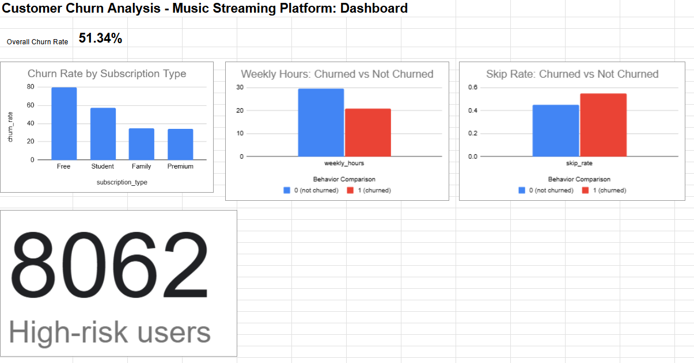

---

## 📈 Key Insights

### 🔴 Overall Churn Rate
- The churn rate is **51.34%**, indicating that more than half of users leave the platform.

---

### 🔴 Subscription Type Impact
- Free users: **79.39% churn**
- Premium users: **33.87% churn**
- Subscription type is the strongest predictor of churn.

---

### 🔴 Engagement Behavior
- Churned users have lower weekly listening hours (**20.82 vs 29.52**)
- Churned users have higher skip rates (**0.55 vs 0.45**)

---

### 🔴 Non-significant Metric
- Playlist creation does not significantly impact churn behavior.

---

## ⚠️ High-Risk Users

A total of **8,062 users** were identified as high-risk based on:
- Low weekly activity
- High skip rate
- Low engagement patterns

This group represents the most immediate churn risk segment.

---

## 💡 Recommendations

1. Improve early user engagement through onboarding and personalization  
2. Enhance recommendation quality to reduce skip rates  
3. Target high-risk users (8,062 segment) with retention campaigns  

---

## 📌 Conclusion

Churn is primarily driven by **user engagement and content relevance**, rather than pricing structure. Improving recommendation systems and increasing early engagement are the most impactful strategies for reducing churn.

---

## 📷 Dashboard

Below is the interactive dashboard built in Google Sheets:

---

## 📊 Live Dashboard

View full Google Sheets dashboard here:  
https://docs.google.com/spreadsheets/d/1OwPixfynLMecO9UkmrWI4bExguYhd3XxMiE72GhZ27g/edit?usp=sharing

---

## 🚀 Key Takeaway

This project demonstrates end-to-end data analysis skills including SQL querying, behavioral segmentation, dashboard creation, and actionable business insights.

## 📊 Dataset

This project uses a publicly available dataset from Kaggle:

- **Name:** Streaming Subscription Churn Dataset  
- **Source:** https://www.kaggle.com/datasets/raghunandan9605/streaming-subscription-churn-dataset  
- **Type:** Synthetic customer behavior dataset  

The dataset simulates user activity on a music streaming platform, including subscription type, engagement metrics, and churn status.
